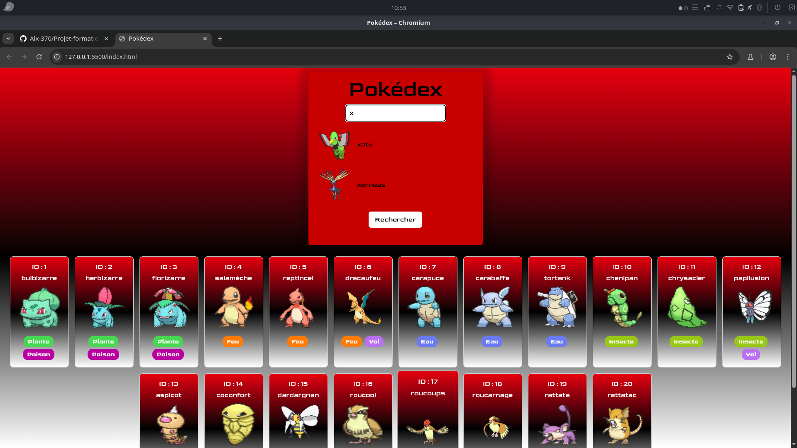

Pokédex Interactif – V1.0
 

 

 Dans le cadre de ma formation, j'ai développé une version améliorée de mon Pokédex. 
  Ce projet m'a permis de mettre en pratique mes compétences en HTML, CSS et JavaScript, 
  en intégrant des fonctionnalités avancées telles que l'autocomplétion, 
  l'affichage dynamique des données et l'interaction avec une API externe. 

  
 🔍Fonctionnalités principales :
Recherche par nom français ou ID : Saisie intuitive avec autocomplétion et suggestions visuelles. 

-Affichage détaillé : Informations complètes sur chaque Pokémon, y compris les types, tailles, poids et statistiques. 
-Sprites dynamiques : Visualisation des sprites statiques et animés, avec possibilité de basculer entre les versions normales et shiny. 
-Galerie interactive : Affichage de cartes Pokémon par lots de 20, avec chargement progressif et navigation fluide. 
-Interface réactive : Design responsive avec effets visuels et transitions pour une expérience utilisateur optimale. 

## 🛠️Compérences :

